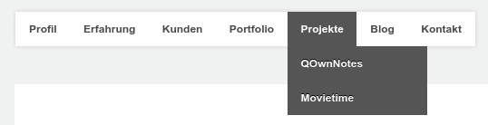
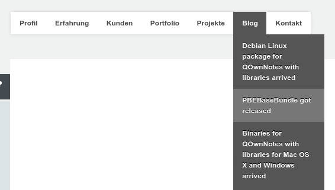

PBE Base Bundle
==========

The **PBE Base Bundle** is a **webpage helper bundle** for the [**eZ Publish 5 Platform**](http://ez.no).

You may also want to visit the [PBEBaseBundle Project Webpage](http://www.bekerle.com/PBEBaseBundle) for more informations.

Implemented features
--------------------

* Two level **top menu** generation from a folder with **folders and links** to be included in the pagelayout.

* `pbe_fetch_content` twig function to **load content** in **twig** templates. This could, for example, be used in the pagelayout to load content from an **object relation list**.

Installation
----------

First you'll need **composer**, if you don't already have it. You can execute this in your eZ Publish root directory.

```shell
curl -sS https://getcomposer.org/installer | php
```

Then you can **require** the bundle:

```shell
php composer.phar require pbe/base-bundle
```

Now you have to **add** the **bundle** to your `ezpublish/EzPublishKernel.php`:

```php
use PBE\BaseBundle\PBEBaseBundle;

...

public function registerBundles()
{
   $bundles = array(
       new FrameworkBundle(),
       ...
       new PBEBaseBundle()
   );

   ...
}
```

Finally you need to **add** the `base.css` file to your `page_head_style.html.twig` like this:

```twig

    <link rel="stylesheet" type="text/css" href="{{ asset_url }}"/>

```

To **override** code of the **PBEBaseBundle** you can also make it **parent** of your bundle.

```php
public function getParent()
{
    return 'PBEBaseBundle';
}
```

Take a look at [How to Use Bundle Inheritance to Override Parts of a Bundle](http://symfony.com/doc/current/cookbook/bundles/inheritance.html) for **more information.**


Usage
-----

### top menu generator
Just include this code into your `pagelayout.html.twig` where you want to put your **main menu**. In this example `86` is the location id of the parent folder.

```twig
{{ render( controller( "PBEBaseBundle:Menu:topMenuFromFolder", { 'parentFolderLocationId': 86 } ) ) }}
```
##### This may look like this



#### Injecting other sub-locations to directly link to

You can also add **sub-locations** that are directly linked to in your menu.

For example for your menu entry with the location id `101` additionally load a maximum of `8` items of location `locationId`.
 
```twig
{{ render( controller( "PBEBaseBundle:Menu:topMenuFromFolder", {
                        'parentFolderLocationId': 86,
                        'directlyIncludedLocations': {
                            101: {
                                'locationId': 70,
                                'limit': 8
                            }
                        }
                    } ) ) }}
```

##### This may look like this

The "Blog" Menu entry has the `locationId` `101`.
The blog posts are directly loaded from the blog (`'locationId': 70`).




### pbe_fetch_content

You can use this **twig function** in your templates to **load content**. In this example `57` is the content id.

```twig

```

It will return a `\eZ\Publish\Core\Repository\Values\Content\Content` object.